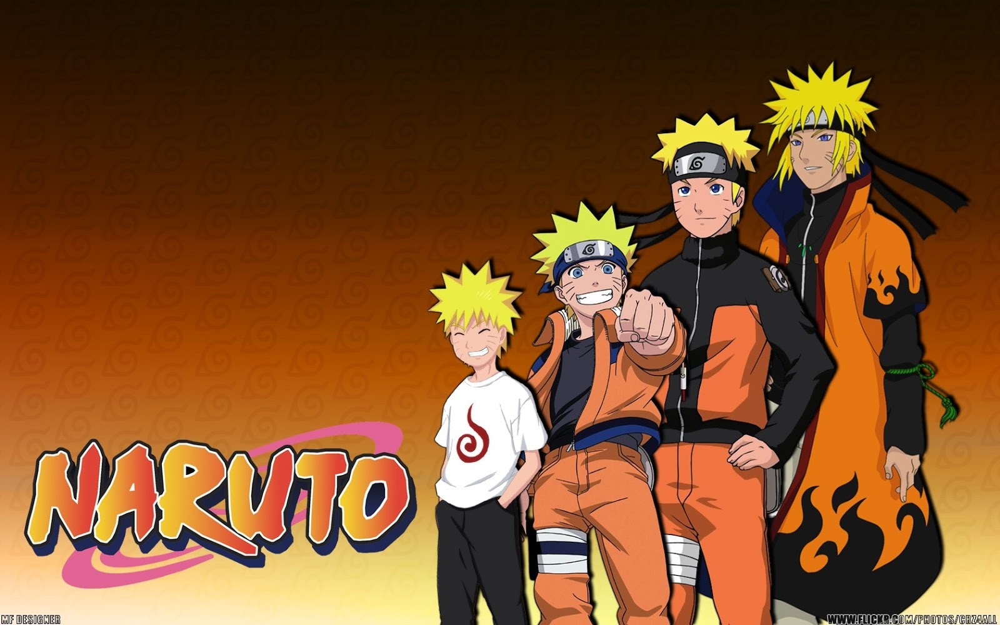

# TV Series Analysis: Naruto Anime

As a lifelong Naruto fan who grew up watching the series, I'm excited to code along with Code In A Jiffy. This project allows me to explore data science concepts and technologies while revisiting the nostalgia of the Naruto anime.

## Overview
...

## Reference
1. [Code In a Jiffy: Build an AI/NLP TV Series Analysis System with Hugging Face, Chatbots, Spacy, Gradio, and Python](https://www.youtube.com/watch?v=_Hxb1zoY0Qw&t=110s)
2. [Visualizing A Neural Machine Translation Model (Mechanics of Seq2seq Models With Attention)](https://jalammar.github.io/visualizing-neural-machine-translation-mechanics-of-seq2seq-models-with-attention/)
